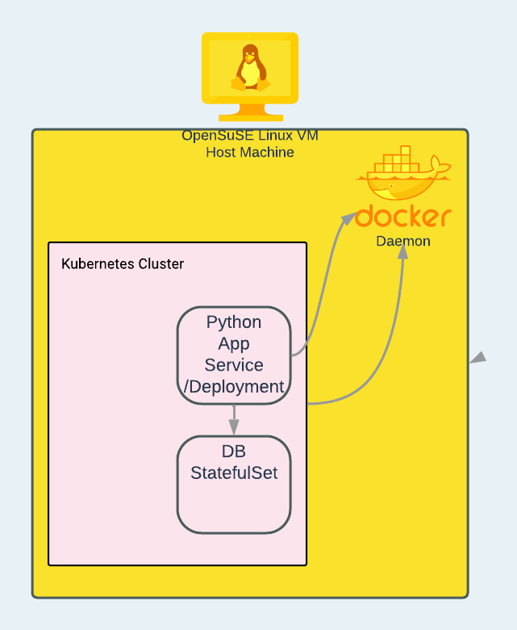
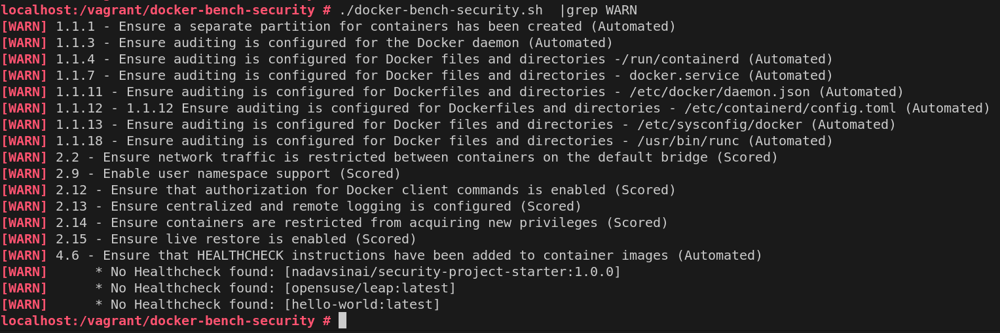

# Threat modeling project

the system is visualized as this

## Docker Threat Modeling
*Instruction* :Given Docker's system components and the STRIDE framework, identify five potential threats that may arise.

1. OSS software security - As we relay of base image (that includes 3rd party OSS) and 
application dependnecies intoduced as part of the application Build (dockerfile run pip ) we may include a tampered 
library which in runtime may "call-base" and introduce information disclosure (data leak) threat of the STRIDE model
2. Registry tampering - since we deploy an image from the registry - if this was hacked - we may introduce a tampered image which may include all sort of threats -Repudiation, tampering, denial of service
3. Docker daemon - if the daemon is hacked - we may introduce a tampered image which may include all sort of threats -Repudiation, tampering, denial of service
4. Docker host misconfiguration - if the host is misconfigured - an image may run with root privileges and may introduce treat to the system and other running processes  - elavation of privilege.
5. Docker client abuse - a malware that takes control of the docker client (eg virus etc) may control the docker host and introduce all sort of threats -Repudiation, tampering.

I scanned the host(virtualbox openSuse Image) with docker-bench and got these results

I decided to taclke the following 3  threats as identified by docker-bench:

1. Ensure Content-trust is enabled - this makes the build/pull/run actions of docker client make use of  DCT validating image are untampered. This relates to the client/registry attack surface
2. ensure logging level is set to 'info' - for this I set the loglevel in  /etc/docker/daemon.json to info and restarted the daemon - this again will allow better debugability as the daemon will output more data to the log. this relates to the running containers attack surface as well as the host
3.  ensure userland proxy is disabled - this too is controled by the daemon.json file. the disabling of this makes the docker host more secure as it for sure will not use proxy to provide networking to containers and will use Hairpin NAT (iptables). - this relates to the host attack surface

after hardning the docker-bench report looks like this 

## Kubernetes Threat Modeling

*instruction*: Given Kubernetes' system components and the STRIDE framework, identify five potential threats that may arise.

1. control plane misconfiguration - a misconfiguration of the control plane may lead to a multiple threats - denial of service, Repudiation, tampering, information disclosure, spoofing.
2. etcd hacked - etcd is the kubernetes database - if it is hacked - it may lead to a multiple threats - denial of service, Repudiation, tampering, information disclosure, spoofing.
3. kubelet hacked - kubelet is the kubernetes agent - if it is hacked - it may lead to a multiple threats - denial of service, Repudiation, tampering, information disclosure, spoofing.
4. kubeapi-server - if the kubeapi-server is hacked - it may lead to a multiple threats - denial of service, Repudiation, tampering, information disclosure, spoofing. 
5. Cloud-ctrl-mgr - is the controller running to manage the cloud provider service (eg loadbalancer etc)- if it is hacked - it may lead to a multiple threats - denial of service, Repudiation, tampering, information disclosure, spoofing.

in the begining the RKE cluster I created had 25 identified threats in kube-bench

after I modifed the configuraiton of the host and cluster.yml as directed this was reduced to 22 like this:

    